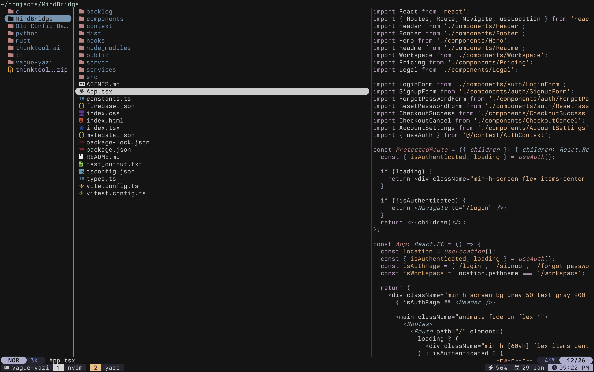

<div align="center">
  
  <h1>Vague for Yazi</h1>
  
</div>

## Usage

### 1. Install the Flavor

- Using Yazi's plugin manager:

    ```
    ya pkg add vague-theme/vague-yazi
    ```

- Manually

    Save the [flavor.toml](flavor.toml) and [tmtheme.xml](tmtheme.xml) files in `~/.config/yazi/flavors/vague.yazi` directory.

    The directory structure should be this:

    ```
    ~/.config/yazi/
    ├── flavors/
    │   ├── vague.yazi/
    └── theme.toml
    ```

### 2. Modify theme.toml

To set it as your dark flavor, change the content of your `theme.toml` file to:

```toml
[flavor]
dark = "vague"
```

Make sure your `theme.toml` doesn't contain anything other than `[flavor]`, unless you want to override certain styles of this flavor.

See the [Yazi flavor documentation](https://yazi-rs.github.io/docs/flavors/overview) for more details.
